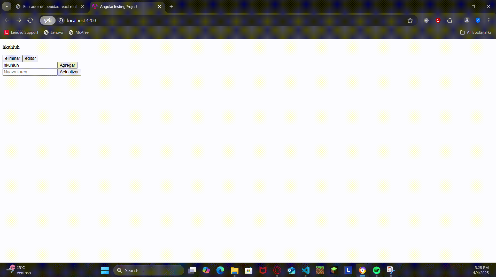

# Angular Task List

Este proyecto es una aplicación de lista de tareas creada con Angular. Está diseñada para enseñar y evaluar conceptos básicos de Angular.

## 🎯 Objetivo

El objetivo de este proyecto es que los estudiantes:

1. Hagan un **fork** de este repositorio.
2. Implementen las funcionalidades solicitadas.
3. Ejecuten pruebas unitarias y visualicen la cobertura de código.
4. Publiquen los resultados en **GitHub Pages**.
5. Configuren la ejecución automática de pruebas en **GitHub Actions**.

## 🛠️ Requisitos Previos

1. Tener instalado **Node.js** y **npm**.
2. Tener instalado **Angular CLI**:
   ```bash
   npm install -g @angular/cli
   ```
3. Tener una cuenta en **GitHub**.

## 📋 Instrucciones

### 1. Hacer un Fork del Proyecto

1. Haz clic en el botón **Fork** en la parte superior derecha de este repositorio.
2. Clona tu fork en tu máquina local:
   ```bash
   git clone https://github.com/<tu-usuario>/angular-testing-project.git
   cd angular-testing-project
   ```

### 2. Instalar Dependencias

Ejecuta el siguiente comando para instalar las dependencias del proyecto:

```bash
npm install
```

## ✅ Desarrollo

### 3. Implementar Funcionalidades


1. Agrega, edita y elimina tareas en la aplicación.
2. Asegúrate de que las tareas se guarden en `localStorage`.
3. Usa las directivas y conceptos de Angular aprendidos en clase.

## 🧪 Pruebas y Cobertura

### 4. Ejecutar Pruebas Unitarias

Ejecuta el servidor de desarrollo para probar tu proyecto:

```bash
npm test
```

Esto ejecutará las pruebas y dejará un resumen en consola.

### 5. Ver Reporte de Cobertura

Genera el reporte con:

```bash
ng test --code-coverage
```

Esto generará una carpeta `coverage/` dentro del proyecto.

### 6. Ver Reporte de Cobertura en el Navegador

Abre el siguiente archivo en tu navegador:

```bash
coverage/index.html
```

Ahí podrás ver el porcentaje de cobertura por archivo y detectar en qué archivos hay fallos o falta de pruebas.

## 🔁 Automatización (CI/CD)

### 6. GitHub Actions: Automatizar pruebas en cada commit

Este repositorio ya incluye un flujo de trabajo en `.github/workflows/test.yml`. Asegúrate de:

- Mantenerlo en tu fork.
- No cambiar el nombre del archivo.
- Al hacer push o pull request, GitHub ejecutará automáticamente las pruebas.

Puedes ver los resultados en la pestaña _Actions_ de tu repositorio.

## 🚀 Despliegue

### 7. Publicar en GitHub Pages

1. Agrega soporte para despliegue:

```bash
ng add angular-cli-ghpages
```

2. Compila y despliega el proyecto:

```bash
npm run deploy
```

3. Accede a tu aplicación publicada:
   `https://<tu-usuario>.github.io/angular-testing-project/
`

## 📝 Descripción del Proyecto

### Funcionalidades del Proyecto

1. ✅ **Agregar Tareas**: Usa el formulario para agregar nuevas tareas.
2. ✅ **Editar Tareas**: Haz clic en "Editar" para modificar una tarea existente.
3. ✅ **Eliminar Tareas**: Haz clic en "Eliminar" para borrar una tarea.
4. ✅ **Guardar Tareas**: Las tareas se guardan en `localStorage` para persistencia.

### Evaluación

Este proyecto evalúa los siguientes conceptos:

1. **Data Binding**:
   - Interpolación
   - Property Binding
   - Event Binding
   - Two-way Binding
2. **Directivas**:
   - Uso de directivas estructurales (`*ngFor`, `*ngIf`) y de atributos (`[ngClass]`, `[ngStyle]`).
3. **Servicios**:
   - Creación y uso de servicios para manejar datos.
4. **Ruteo**:
   - Configuración de rutas y navegación programática.
5. **Despliegue**:
   - Publicación del proyecto en GitHub Pages.

---

¡Buena suerte y diviértete aprendiendo Angular! 🚀

## 📄 Licencia

Este proyecto está bajo la Licencia MIT. Consulta el archivo [LICENSE](LICENSE) para más detalles.

## 📧 Contacto

[Inadaptados](https://inadaptados.mx,)
